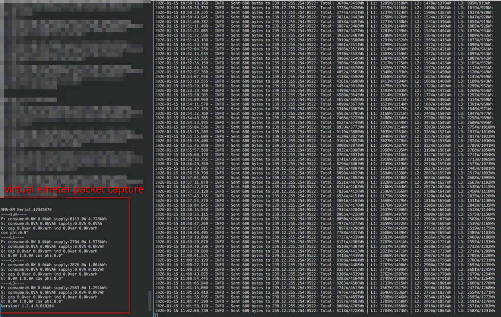

# SMA Energy Meter Emulator

This project emulates an SMA Energy Meter by generating and sending UDP multicast packets that mimic the data format used by real SMA meters. It is useful for testing and development of systems that integrate with SMA energy meters, such as Home Assistant or other energy monitoring solutions.

it is based on `emeter.py` from the deprecated homeassistant emulator found on https://github.com/Roeland54/SMA-Energy-Meter-emulator.

## Features
- Generates packets with configurable measurement and counter values.
- Sends packets to the standard SMA multicast address and port.
- Easily extensible for additional measurements or custom logic.

## Installation

### Prerequisites

- Python 3.6 or newer
- pip (Python package installer)

### Install Dependencies

Clone the repository and install the required dependencies:

```bash
git clone https://github.com/daimoniac/pysmaemeter.git
cd pysmaemeter
```

#### Using a Virtual Environment (Recommended)

It's recommended to use a Python virtual environment to isolate project dependencies:

```bash
# Create a virtual environment
python3 -m venv venv

# Activate the virtual environment
# On Linux/macOS:
source venv/bin/activate
# On Windows:
# venv\Scripts\activate

# Install dependencies
pip install -r requirements.txt
```

#### Global Installation

Alternatively, you can install dependencies globally (not recommended):

```bash
pip install -r requirements.txt
```

## Usage

### Prerequisites

- Python 3.6 or newer

### Running the Emulator

Run the packet sender:
```bash
python3 send_packet.py
```

This will send a single emulated packet to the multicast address `239.12.255.254:9522`.

### Command-line Arguments

You can customize the packet by passing the following arguments:

- `--serial`: Serial number for the emeter device (default: `12345678`)
- `--address`: UDP multicast address (default: `239.12.255.254`)
- `--port`: UDP port (default: `9522`)
- `--power`: Positive active power in watts (default: `1234`)
- `--energy`: Positive active energy in watt-hours (default: `567890`)

**Example:**
```bash
python3 send_packet.py --serial 98765432 --power 2500 --energy 123456
```

### Running the Data Aggregator and Emulator



For real-world deployments, you can use `collect_and_emeterize.py` to continuously collect data from multiple devices that provide modbus or speedwire interfaces (doesnt matter which vendor) and emulate a virtual energy meter that broadcasts aggregated data for consumption by your SMA sunnyportal.

```bash
python3 collect_and_emeterize.py
```

This script:
- **Reads from multiple sources**: Collects power and energy data from SMA inverters via Modbus TCP (type `8001`) and Speedwire gateways (type `9999`)
- **Aggregates data**: Combines measurements from all configured devices and distributes values across three phases proportionally based on phase power
- **Emulates a virtual meter**: Sends aggregated data as SMA Energy Meter packets to the multicast address at configurable intervals
- **Handles errors gracefully**: Includes retry logic for Modbus connections, timeouts for Speedwire requests, and continues operating even if individual devices fail

**Configuration:**
The script reads device and system settings from `config.json`, which includes:
- Device list with IP addresses and types (Modbus or Speedwire)
- Modbus connection parameters (base IP, port, retry settings)
- Multicast settings for packet broadcasting
- Scheduler interval for data collection
- Logging configuration

**Example `config.json` structure:**
see `config.json`

## Testing

### unit test

To run the tests, execute the following command in your terminal:

```bash
python3 tests/test_emeter.py
```

### integration test

You can use https://github.com/datenschuft/SMA-EM to capture and interpret the package.

```
% ./sma-em-capture-package.py
----raw-output---
b'SMA\x00\x00\x04\x02\xa0\x00\x00\x00\x01\x020\x00\x10`i\x01\x0e\x00\xbcaN\x86\x94\x8e\x83\x00\x03\x04\x00\x00\x00\x00\x00\x00\x03\x08\x00\x00\x00\x00\x00\x00\x00\x00\x00\x00\x04\x04\x00\x00\x00\x00\x00\x00\x04\x08\x00\x00\x00\x00\x00\x00\x00\x00\x00\x00\t\x04\x00\x00\x00\x00\x00\x00\t\x08\x00\x00\x00\x00\x00\x00\x00\x00\x00\x00\n\x04\x00\x00\x00\x00\x00\x00\n\x08\x00\x00\x00\x00\x00\x00\x00\x00\x00\x00\r\x04\x00\x00\x00\x00\x00\x00\x15\x04\x00\x00\x00\x00\x00\x00\x15\x08\x00\x00\x00\x00\x00\x00\x00\x00\x00\x00\x16\x04\x00\x00\x00\x00\x00\x00\x16\x08\x00\x00\x00\x00\x00\x00\x00\x00\x00\x00\x17\x04\x00\x00\x00\x00\x00\x00\x17\x08\x00\x00\x00\x00\x00\x00\x00\x00\x00\x00\x18\x04\x00\x00\x00\x00\x00\x00\x18\x08\x00\x00\x00\x00\x00\x00\x00\x00\x00\x00\x1d\x04\x00\x00\x00\x00\x00\x00\x1d\x08\x00\x00\x00\x00\x00\x00\x00\x00\x00\x00\x1e\x04\x00\x00\x00\x00\x00\x00\x1e\x08\x00\x00\x00\x00\x00\x00\x00\x00\x00\x00\x1f\x04\x00\x00\x00\x00\x00\x002\x04\x00\x00\x00\x00\x00\x00!\x04\x00\x00\x00\x00\x00\x00)\x04\x00\x00\x00\x00\x00\x00)\x08\x00\x00\x00\x00\x00\x00\x00\x00\x00\x00*\x04\x00\x00\x00\x00\x00\x00*\x08\x00\x00\x00\x00\x00\x00\x00\x00\x00\x00+\x04\x00\x00\x00\x00\x00\x00+\x08\x00\x00\x00\x00\x00\x00\x00\x00\x00\x00,\x04\x00\x00\x00\x00\x00\x00,\x08\x00\x00\x00\x00\x00\x00\x00\x00\x00\x001\x04\x00\x00\x00\x00\x00\x001\x08\x00\x00\x00\x00\x00\x00\x00\x00\x00\x002\x04\x00\x00\x00\x00\x00\x002\x08\x00\x00\x00\x00\x00\x00\x00\x00\x00\x003\x04\x00\x00\x00\x00\x00\x004\x04\x00\x00\x00\x00\x00\x005\x04\x00\x00\x00\x00\x00\x00=\x04\x00\x00\x00\x00\x00\x00=\x08\x00\x00\x00\x00\x00\x00\x00\x00\x00\x00>\x04\x00\x00\x00\x00\x00\x00>\x08\x00\x00\x00\x00\x00\x00\x00\x00\x00\x00?\x04\x00\x00\x00\x00\x00\x00?\x08\x00\x00\x00\x00\x00\x00\x00\x00\x00\x00@\x04\x00\x00\x00\x00\x00\x00@\x08\x00\x00\x00\x00\x00\x00\x00\x00\x00\x00E\x04\x00\x00\x00\x00\x00\x00E\x08\x00\x00\x00\x00\x00\x00\x00\x00\x00\x00F\x04\x00\x00\x00\x00\x00\x00F\x08\x00\x00\x00\x00\x00\x00\x00\x00\x00\x00G\x04\x00\x00\x00\x00\x00\x00H\x04\x00\x00\x00\x00\x00\x00I\x04\x00\x00\x00\x00\x00\x00\x01\x04\x00\x00\x00\x04\xd2\x00\x01\x08\x00\x00\x00\x00\x00\x00\x08\xaaR\x90\x00\x00\x00\x01\x02\x04R\x00\x00\x00\x00'
----asci-output---
b'534d4100000402a000000001023000106069010e00bc614e86948e83000304000000000000030800000000000000000000040400000000000004080000000000000000000009040000000000000908000000000000000000000a040000000000000a08000000000000000000000d0400000000000015040000000000001508000000000000000000001604000000000000160800000000000000000000170400000000000017080000000000000000000018040000000000001808000000000000000000001d040000000000001d08000000000000000000001e040000000000001e08000000000000000000001f040000000000003204000000000000210400000000000029040000000000002908000000000000000000002a040000000000002a08000000000000000000002b040000000000002b08000000000000000000002c040000000000002c0800000000000000000000310400000000000031080000000000000000000032040000000000003208000000000000000000003304000000000000340400000000000035040000000000003d040000000000003d08000000000000000000003e040000000000003e08000000000000000000003f040000000000003f0800000000000000000000400400000000000040080000000000000000000045040000000000004508000000000000000000004604000000000000460800000000000000000000470400000000000048040000000000004904000000000000010400000004d200010800000000000008aa52900000000102045200000000'
----all-found-values---
serial: value:12345678
qconsume: value:0.0
qconsumeunit: value:VAr
qconsumecounter: value:0.0
qconsumecounterunit: value:kVArh
qsupply: value:0.0
qsupplyunit: value:VAr
qsupplycounter: value:0.0
qsupplycounterunit: value:kVArh
sconsume: value:0.0
sconsumeunit: value:VA
sconsumecounter: value:0.0
sconsumecounterunit: value:kVAh
ssupply: value:0.0
ssupplyunit: value:VA
ssupplycounter: value:0.0
ssupplycounterunit: value:kVAh
cosphi: value:0.0
cosphiunit: value:°
p1consume: value:0.0
p1consumeunit: value:W
p1consumecounter: value:0.0
p1consumecounterunit: value:kWh
p1supply: value:0.0
p1supplyunit: value:W
p1supplycounter: value:0.0
p1supplycounterunit: value:kWh
q1consume: value:0.0
q1consumeunit: value:VAr
q1consumecounter: value:0.0
q1consumecounterunit: value:kVArh
q1supply: value:0.0
q1supplyunit: value:VAr
q1supplycounter: value:0.0
q1supplycounterunit: value:kVArh
s1consume: value:0.0
s1consumeunit: value:VA
s1consumecounter: value:0.0
s1consumecounterunit: value:kVAh
s1supply: value:0.0
s1supplyunit: value:VA
s1supplycounter: value:0.0
s1supplycounterunit: value:kVAh
i1: value:0.0
i1unit: value:A
s2supply: value:0.0
s2supplyunit: value:VA
cosphi1: value:0.0
cosphi1unit: value:°
p2consume: value:0.0
p2consumeunit: value:W
p2consumecounter: value:0.0
p2consumecounterunit: value:kWh
p2supply: value:0.0
p2supplyunit: value:W
p2supplycounter: value:0.0
p2supplycounterunit: value:kWh
q2consume: value:0.0
q2consumeunit: value:VAr
q2consumecounter: value:0.0
q2consumecounterunit: value:kVArh
q2supply: value:0.0
q2supplyunit: value:VAr
q2supplycounter: value:0.0
q2supplycounterunit: value:kVArh
s2consume: value:0.0
s2consumeunit: value:VA
s2consumecounter: value:0.0
s2consumecounterunit: value:kVAh
s2supplycounter: value:0.0
s2supplycounterunit: value:kVAh
i2: value:0.0
i2unit: value:A
u2: value:0.0
u2unit: value:V
cosphi2: value:0.0
cosphi2unit: value:°
p3consume: value:0.0
p3consumeunit: value:W
p3consumecounter: value:0.0
p3consumecounterunit: value:kWh
p3supply: value:0.0
p3supplyunit: value:W
p3supplycounter: value:0.0
p3supplycounterunit: value:kWh
q3consume: value:0.0
q3consumeunit: value:VAr
q3consumecounter: value:0.0
q3consumecounterunit: value:kVArh
q3supply: value:0.0
q3supplyunit: value:VAr
q3supplycounter: value:0.0
q3supplycounterunit: value:kVArh
s3consume: value:0.0
s3consumeunit: value:VA
s3consumecounter: value:0.0
s3consumecounterunit: value:kVAh
s3supply: value:0.0
s3supplyunit: value:VA
s3supplycounter: value:0.0
s3supplycounterunit: value:kVAh
i3: value:0.0
i3unit: value:A
u3: value:0.0
u3unit: value:V
cosphi3: value:0.0
cosphi3unit: value:°
pconsume: value:123.4
pconsumeunit: value:W
pconsumecounter: value:0.15774722222222223
pconsumecounterunit: value:kWh
speedwire-version: value:1.2.4.R|010204
```

### Customization

- Edit `send_packet.py` to change the serial number or measurement values.
- The packet structure and available measurement IDs are defined in [`emeter.py`](emeter.py).

## File Overview

- [`send_packet.py`](send_packet.py): Main script to generate and send a sample packet.
- [`emeter.py`](emeter.py): Contains the `emeterPacket` class, which builds the packet data.
- `.github/workflows/`: Contains GitHub Actions workflows for linting and building.
- [`LICENSE`](LICENSE): Apache License 2.0.

## Development

### Contributing

Contributions are welcome! Please open issues or pull requests as needed.

## License
This project is licensed under the [Apache License 2.0](LICENSE).
