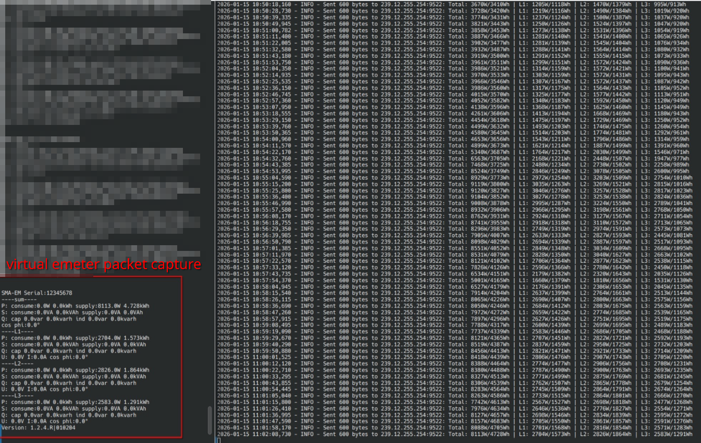

# pysmaemeter

Python toolkit for speaking the SMA Energy Meter protocol.

This repository has three main purposes:

1. `lib/emeter.py`: a reusable Python library that builds valid SMA Energy Meter multicast packets.
2. `collect_and_emeterize/`: collector runtime that aggregates inverter sources and publishes one virtual SMA Energy Meter (PV / supply).
3. `janitza_emeter/`: independent Modbus-to-Speedwire bridge that publishes a Janitza UMG 604-PRO as a bidirectional SMA grid meter.

The packet implementation is based on historical `emeter.py` work from the deprecated Home Assistant emulator project:
https://github.com/Roeland54/SMA-Energy-Meter-emulator

## What this repo does

- Builds SMA-compatible UDP multicast packets (default `239.12.255.254:9522`).
- Supports direct packet emission for testing (`send_packet.py`).
- Aggregates inverter data from multiple devices and protocols (`collect_and_emeterize/`).
- Converts aggregated values into SMA meter fields (including phase-level values).
- Persists and rolls over a cumulative yield counter across restarts and day boundaries.
- Reflects Janitza grid meter P/E (total + L1–L3, import and export) as a second virtual Energy Meter.

## Repository layout

- `lib/emeter.py`: core packet builder (`emeterPacket`) and SMA measurement IDs.
- `lib/multicast.py`: shared UDP multicast sender.
- `lib/sma_units.py`: SMA power/energy scaling constants.
- `lib/speedwire_multigate_asyncio.py`: async Speedwire query client helper.
- `collect_and_emeterize/`: PV collector + aggregator + multicast publisher (config lives here).
- `collect_and_emeterize.py`: shim that runs the PV collector (old invocation still works).
- `janitza_emeter/`: Janitza Modbus TCP grid-meter bridge and its own `config.json`.
- `send_packet.py`: one-shot packet sender for quick verification.
- `tests/test_emeter.py`: unit tests for packet encoding primitives and sizing behavior.
- `tests/test_janitza_mapping.py`: unit tests for Janitza register mapping and hold/silence.
- `doc/collect_and_emeterize.png`: high-level flow diagram.

## Installation

Prerequisites:

- Python 3.8+
- pip

Install:

```bash
git clone https://github.com/daimoniac/pysmaemeter.git
cd pysmaemeter
python3 -m venv .venv
source .venv/bin/activate
pip install -r requirements.txt
```

Current runtime dependencies:

- `pymodbus==2.5.3`
- `schedule==1.2.0`

## Usage

### 1) Send a single test packet

```bash
python3 send_packet.py
```

Custom example:

```bash
python3 send_packet.py --serial 98765432 --power 2500 --energy 123456
```

CLI options:

- `--serial`: meter serial number (default `12345678`)
- `--address`: multicast address (default `239.12.255.254`)
- `--port`: multicast port (default `9522`)
- `--power`: positive active power in watts (default `1234`)
- `--energy`: positive active energy in watt-hours (default `567890`)

### 2) Run the collector/emulator service

```bash
python3 collect_and_emeterize.py
# or: python3 collect_and_emeterize/collect_and_emeterize.py
```

What it does continuously:

- Reads device data from configured sources.
- Supports device types:
	- `8001`: SMA inverter via Modbus TCP registers.
	- `9999`: Speedwire source via async query helper.
- Aggregates total and per-phase power/yield across devices.
- Emits one virtual SMA meter packet at a fixed interval.
- Tracks persistent total yield using `total_counter.json` and midnight rollover logic.

Reference diagram:



### 3) Run the Janitza grid-meter bridge

Run this on a host that can reach the UMG on TCP/502 **and** that shares L2 multicast with the SMA Data Manager (typically `192.168.10.224`):

```bash
python3 janitza_emeter/janitza_emeter.py
```

It reads signed power and lifetime import/export energy from the UMG (holding registers `19020`–`19076`) and emits a bidirectional SMA Energy Meter telegram. Missed reads repeat the last snapshot for `scheduler.hold_ticks` seconds, then go silent. Set `emeter.invert_direction` if CT orientation is reversed.

## Configuration

PV collector: `collect_and_emeterize/config.json`.

- `logging`: log level/format
- `multicast`: `address`, `port`, `ttl`
- `emeter`:
	- `serial_number`: emulated meter serial
	- `totalyieldbaseline`: baseline total yield in kWh
- `modbus`: `base_ip`, `port`, `unit_id`, retry settings, `timeout` (seconds per socket operation, default 2)
- `speedwire`: `timeout` (seconds for the full query sequence, default 2)
- `scheduler`: send interval (`interval_seconds`)
- `devices`: map of device IDs to `type` and `name`

Notes:

- Device IDs in `devices` are used as last-octet suffixes for Modbus host addressing (`base_ip.<device_id>`) for type `8001` devices.
- Collector validation fails fast if required sections/keys are missing.

Janitza bridge: `janitza_emeter/config.json` (`modbus.host/port/unit_id`, `emeter.serial_number`, `emeter.invert_direction`, multicast, `scheduler.interval_seconds` / `hold_ticks`).

## Library usage (minimal example)

```python
import time
from lib.emeter import emeterPacket

packet = emeterPacket(12345678)
packet.begin(int(time.time() * 1000))
packet.addMeasurementValue(emeterPacket.SMA_POSITIVE_ACTIVE_POWER, 1234)
packet.addCounterValue(emeterPacket.SMA_POSITIVE_ACTIVE_ENERGY, 567890 * 3600)
packet.end()

data = packet.getData()[:packet.getLength()]
```

## Testing

Run unit tests:

```bash
python3 tests/test_emeter.py
python3 tests/test_janitza_mapping.py
```

For packet-level verification against external tooling, you can inspect emitted multicast packets with:

https://github.com/datenschuft/SMA-EM

## Contributing

Contributions and issue reports are welcome.

## License

Licensed under the Apache License 2.0. See `LICENSE`.
